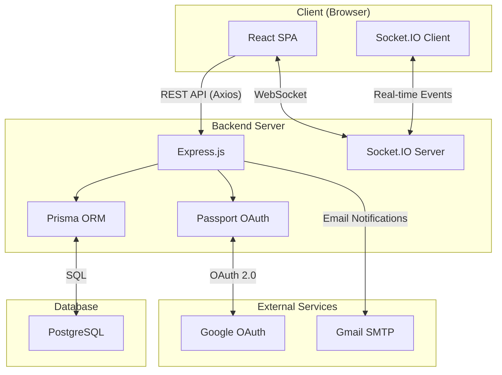
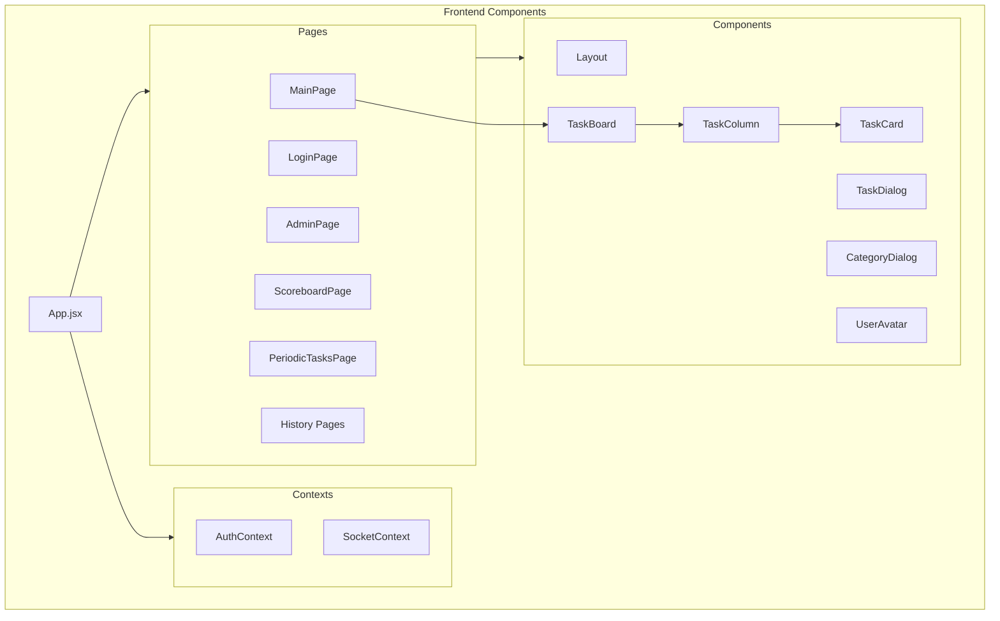
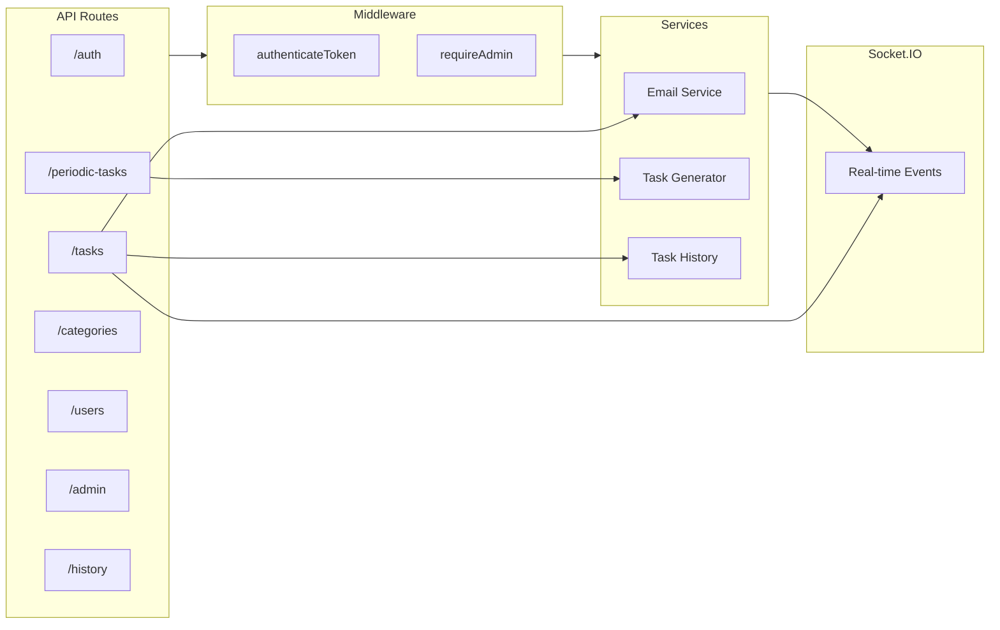
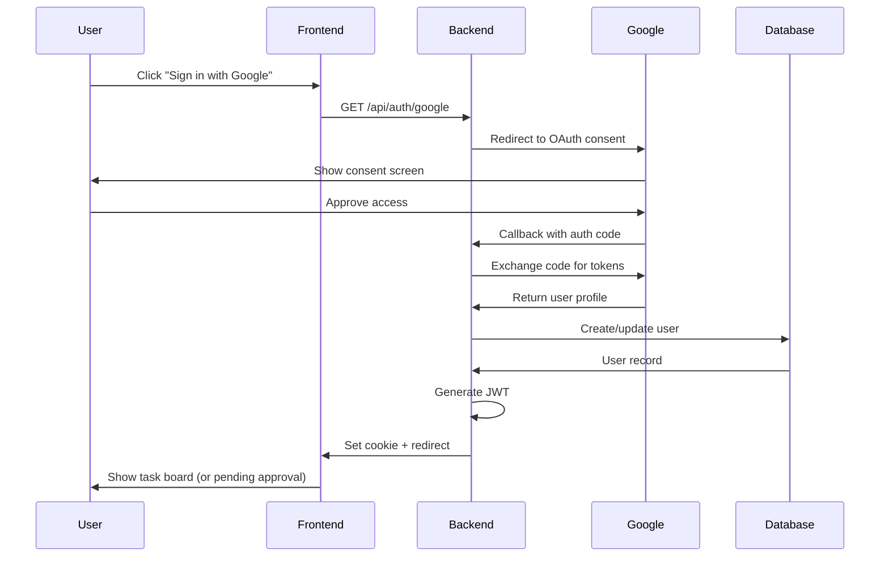
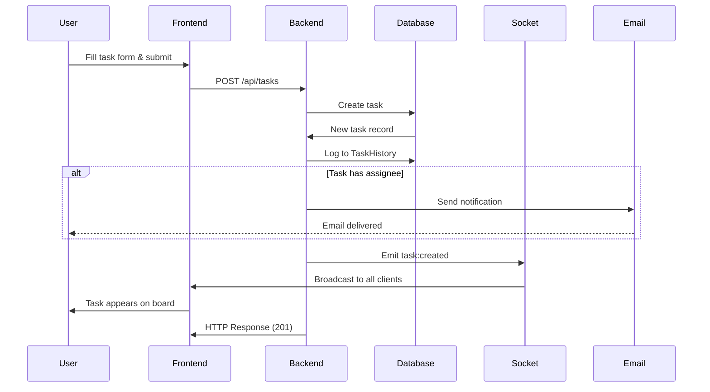
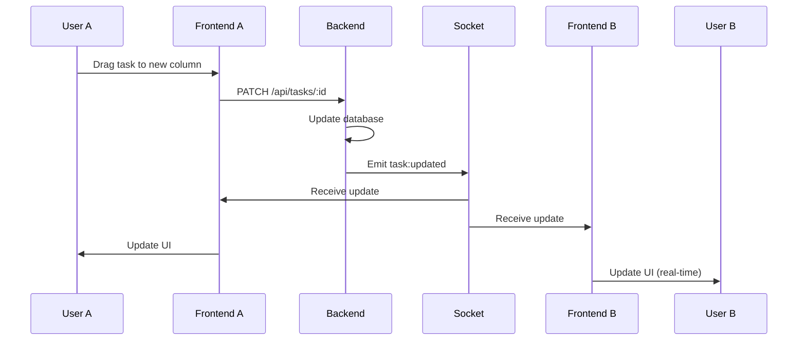
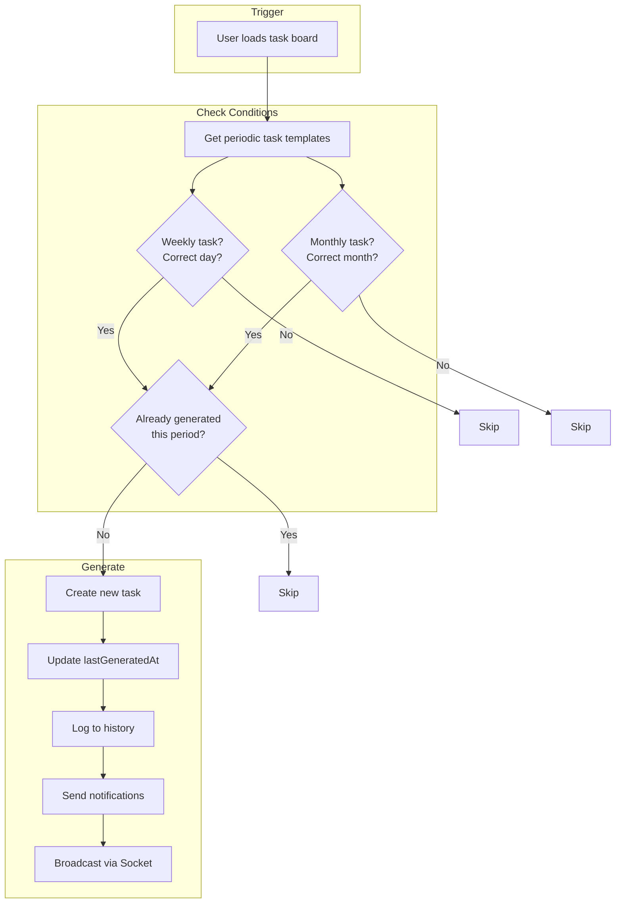
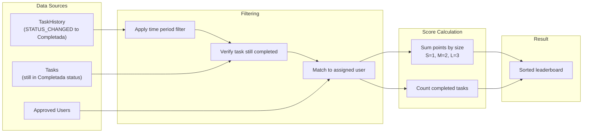

# Architecture Diagrams

All diagrams use [Mermaid](https://mermaid.js.org/) syntax and render automatically on GitHub.

## System Architecture

## Component Architecture

## Backend Architecture

## Authentication Flow

## Task Creation Flow

## Real-time Update Flow

## Periodic Task Generation

## Scoring System Flow

