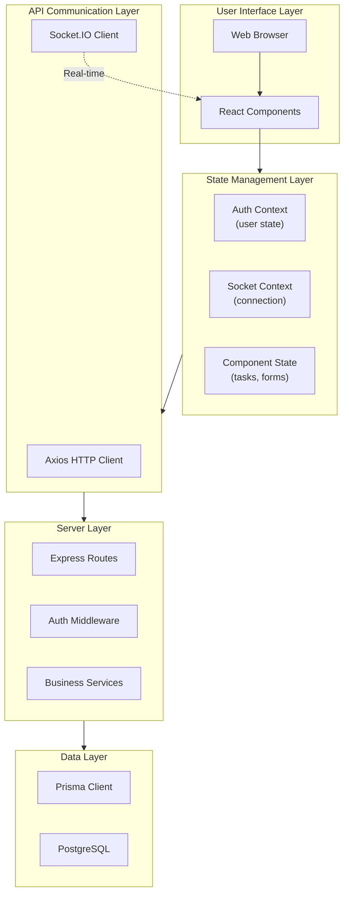
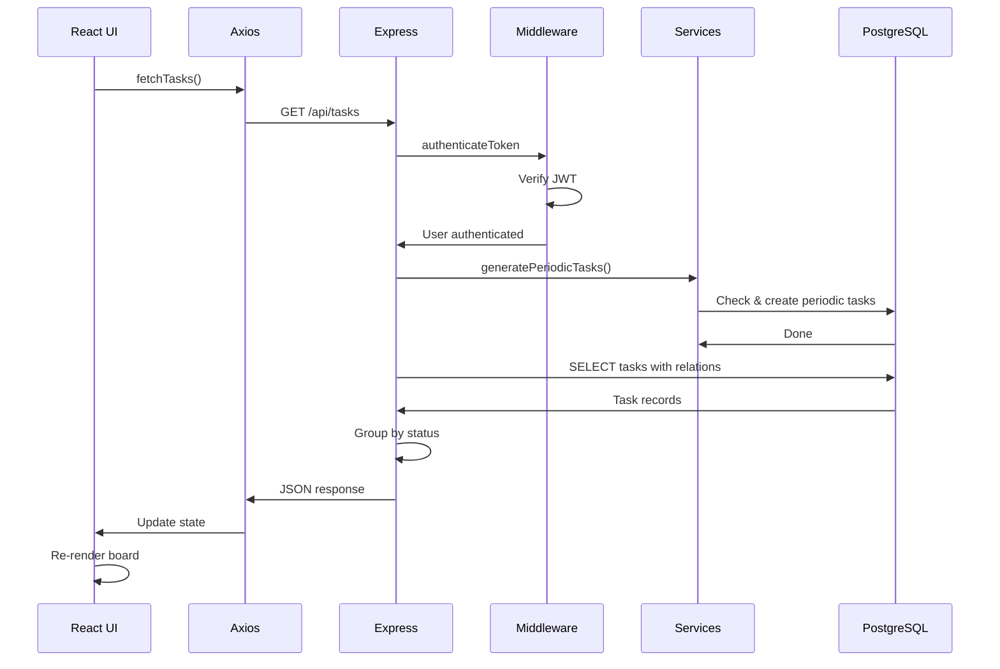
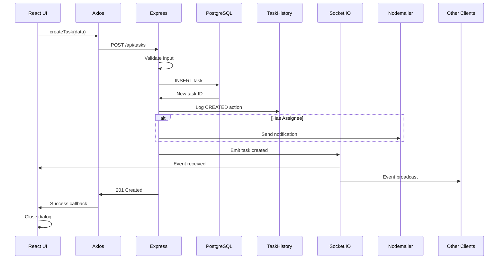
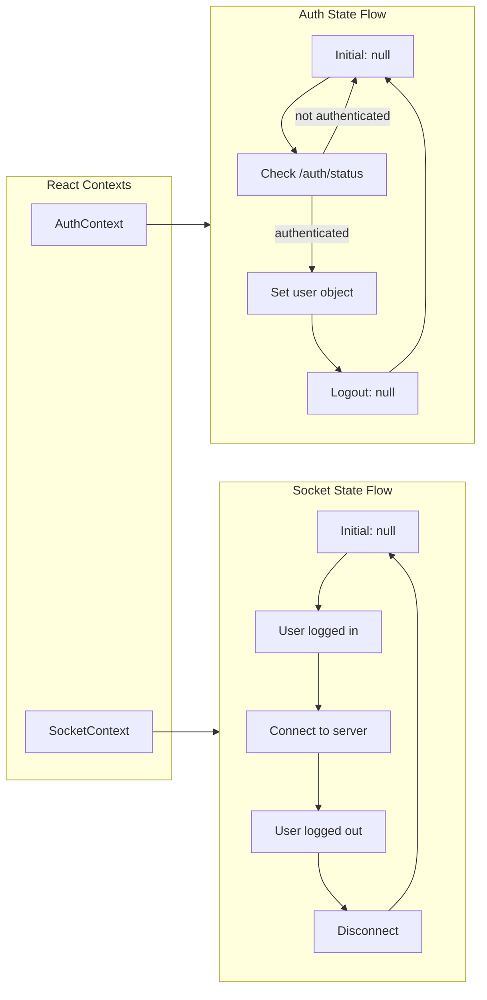
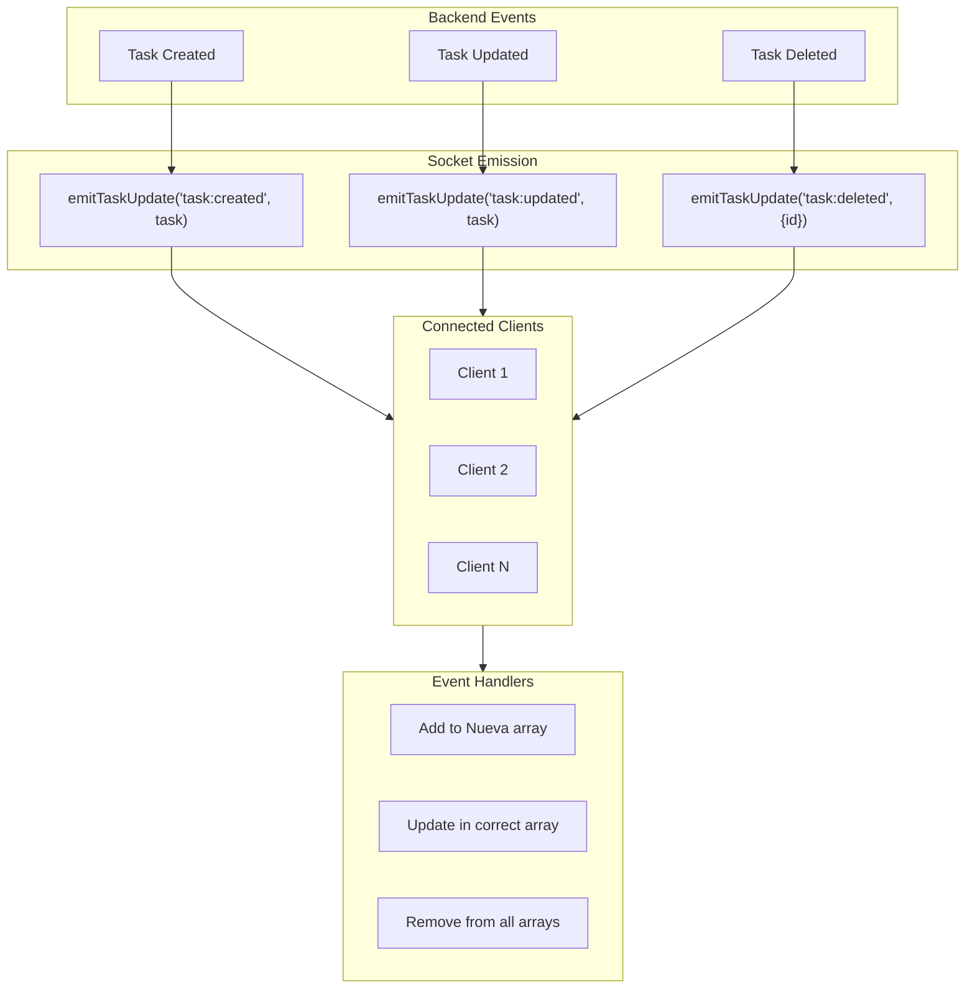
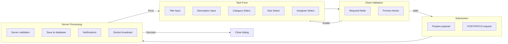
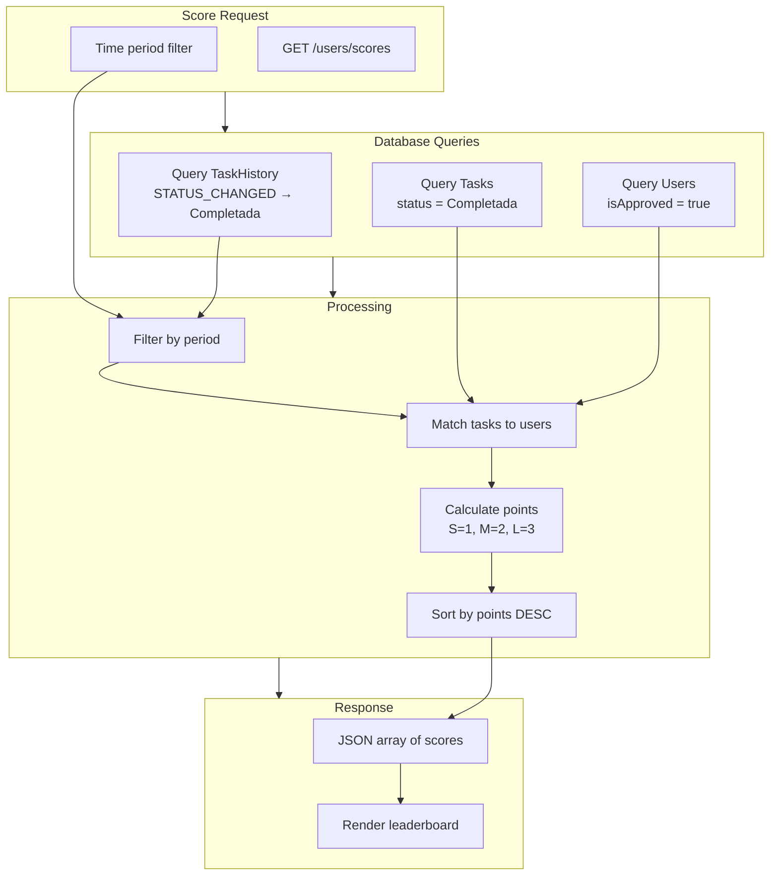

# Data Flow Diagrams

## Application Data Flow Overview

## Request/Response Flow

### Read Operation (GET Tasks)

### Write Operation (Create Task)

## State Management Flow

## Event Flow (Real-time Updates)

## Authentication Data Flow

```mermaid
flowchart TB
    subgraph Login["Login Flow"]
        L1["Click Login"]
        L2["Redirect to Google"]
        L3["User consents"]
        L4["Callback with code"]
        L5["Exchange for tokens"]
        L6["Get user profile"]
        L7["Create/update DB user"]
        L8["Generate JWT"]
        L9["Set HTTP-only cookie"]
        L10["Redirect to app"]
    end

    subgraph Session["Session Flow"]
        S1["Every API request"]
        S2["Cookie sent automatically"]
        S3["Middleware extracts JWT"]
        S4["Verify signature"]
        S5["Attach user to request"]
        S6["Continue to route"]
    end

    subgraph Logout["Logout Flow"]
        O1["Click Logout"]
        O2["POST /auth/logout"]
        O3["Clear cookie"]
        O4["Clear client state"]
        O5["Redirect to login"]
    end

    L1 --> L2 --> L3 --> L4 --> L5 --> L6 --> L7 --> L8 --> L9 --> L10

    S1 --> S2 --> S3 --> S4 --> S5 --> S6

    O1 --> O2 --> O3 --> O4 --> O5
```

## Form Data Flow

## Scoring Data Flow

