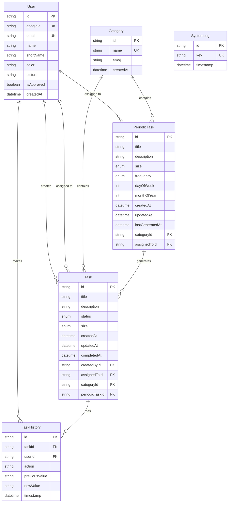
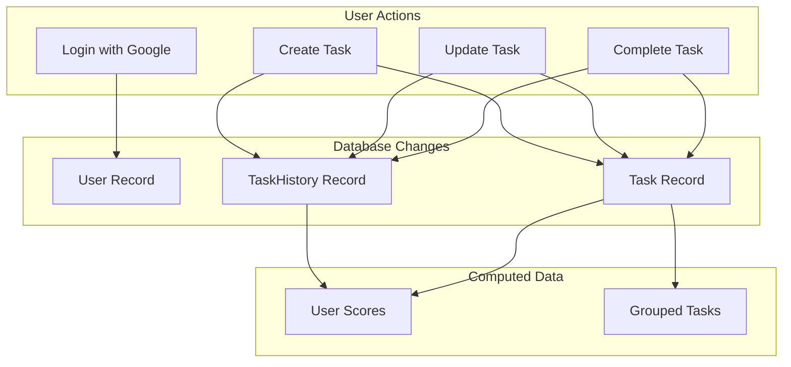

# Database Schema Diagrams

## Entity Relationship Diagram



## Table Schemas

### User
| Column | Type | Constraints | Description |
|--------|------|-------------|-------------|
| id | UUID | PK, DEFAULT uuid() | Unique identifier |
| googleId | String | UNIQUE, NOT NULL | Google OAuth ID |
| email | String | UNIQUE, NOT NULL | User's email |
| name | String | NOT NULL | Full name from Google |
| shortName | String | NULL | Display nickname |
| color | String | NULL | Hex color code |
| picture | String | NULL | Profile picture URL |
| isApproved | Boolean | DEFAULT false | Access approval status |
| createdAt | DateTime | DEFAULT now() | Registration timestamp |

### Task
| Column | Type | Constraints | Description |
|--------|------|-------------|-------------|
| id | UUID | PK, DEFAULT uuid() | Unique identifier |
| title | String | NOT NULL | Task title |
| description | String | NULL | Detailed description |
| status | Enum | DEFAULT 'Nueva' | Nueva, EnProgreso, Completada |
| size | Enum | DEFAULT 'Pequena' | Pequena, Mediana, Grande |
| createdAt | DateTime | DEFAULT now() | Creation timestamp |
| updatedAt | DateTime | AUTO | Last modification |
| completedAt | DateTime | NULL | Completion timestamp |
| createdById | UUID | FK → User.id | Task creator |
| assignedToId | UUID | FK → User.id, NULL | Assigned user |
| categoryId | UUID | FK → Category.id, NULL | Task category |
| periodicTaskId | UUID | FK → PeriodicTask.id, NULL | Parent template |

### PeriodicTask
| Column | Type | Constraints | Description |
|--------|------|-------------|-------------|
| id | UUID | PK, DEFAULT uuid() | Unique identifier |
| title | String | NOT NULL | Template title |
| description | String | NULL | Template description |
| size | Enum | DEFAULT 'Pequena' | Default task size |
| frequency | Enum | NOT NULL | WEEKLY or MONTHLY |
| dayOfWeek | Int | NULL, 0-6 | Day for weekly tasks |
| monthOfYear | Int | NULL, 0-11 | Month for monthly tasks |
| createdAt | DateTime | DEFAULT now() | Creation timestamp |
| updatedAt | DateTime | AUTO | Last modification |
| lastGeneratedAt | DateTime | NULL | Last task generation |
| categoryId | UUID | FK → Category.id | Required category |
| assignedToId | UUID | FK → User.id, NULL | Default assignee |

### Category
| Column | Type | Constraints | Description |
|--------|------|-------------|-------------|
| id | UUID | PK, DEFAULT uuid() | Unique identifier |
| name | String | UNIQUE, NOT NULL | Category name |
| emoji | String | NOT NULL | Display emoji |
| createdAt | DateTime | DEFAULT now() | Creation timestamp |

### TaskHistory
| Column | Type | Constraints | Description |
|--------|------|-------------|-------------|
| id | UUID | PK, DEFAULT uuid() | Unique identifier |
| taskId | UUID | FK → Task.id | Related task |
| userId | UUID | FK → User.id | User who made change |
| action | String | NOT NULL | Action type |
| previousValue | String | NULL | Value before change |
| newValue | String | NULL | Value after change |
| timestamp | DateTime | DEFAULT now() | When change occurred |

### SystemLog
| Column | Type | Constraints | Description |
|--------|------|-------------|-------------|
| id | UUID | PK, DEFAULT uuid() | Unique identifier |
| key | String | UNIQUE, NOT NULL | Log key identifier |
| timestamp | DateTime | DEFAULT now() | Log timestamp |

## Enumerations

### TaskStatus
```
Nueva       → New task, not started
EnProgreso  → In progress, being worked on
Completada  → Completed, finished
```

### TaskSize
```
Pequena  → Small task (1 point)
Mediana  → Medium task (2 points)
Grande   → Large task (3 points)
```

### Frequency
```
WEEKLY   → Generated weekly on specified day
MONTHLY  → Generated monthly during specified month
```

## Indexes

The following indexes are automatically created by Prisma:

| Table | Index | Type |
|-------|-------|------|
| User | googleId | UNIQUE |
| User | email | UNIQUE |
| Category | name | UNIQUE |
| SystemLog | key | UNIQUE |
| Task | createdById | FK INDEX |
| Task | assignedToId | FK INDEX |
| Task | categoryId | FK INDEX |
| Task | periodicTaskId | FK INDEX |
| TaskHistory | taskId | FK INDEX |
| TaskHistory | userId | FK INDEX |
| PeriodicTask | categoryId | FK INDEX |
| PeriodicTask | assignedToId | FK INDEX |

## Cascade Rules

| Relationship | On Delete |
|--------------|-----------|
| Task → TaskHistory | CASCADE (delete history with task) |
| Task → PeriodicTask | SET NULL (preserve task, clear reference) |
| User → Task (creator) | RESTRICT (cannot delete user with tasks) |
| User → Task (assignee) | SET NULL (unassign if user deleted) |
| Category → Task | RESTRICT (cannot delete category with tasks) |

## Data Flow Diagram


