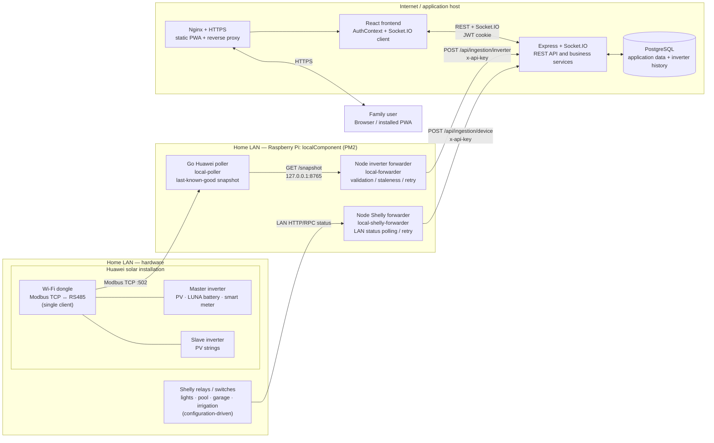
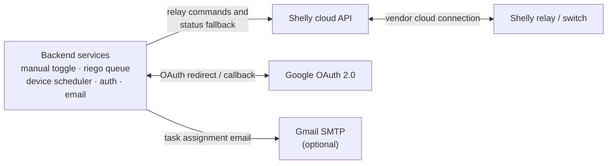
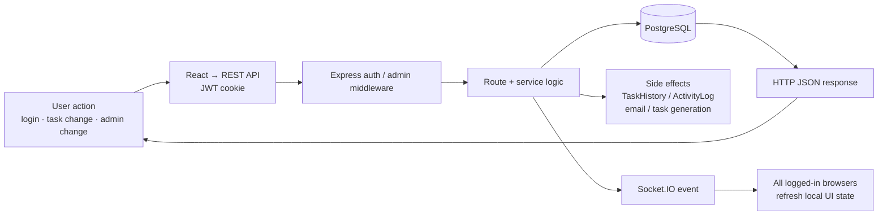

# Whole-System Design

This is the current, implementation-oriented view of **Tareas Pendientes**. It includes the public web app, the main backend, the on-site Raspberry Pi (`localComponent`), and the physical and cloud-connected devices. Use it as the starting point when changing an integration.

## Topology and communication boundaries



The main diagram deliberately follows the dominant telemetry path from left to right: **house hardware → Pi → backend**, with the browser connected at the right edge. Cloud integrations are shown separately below, because forcing their reverse control path into this lane was what made the original diagram cross through unrelated blocks.



### Important boundaries

- The Pi never exposes the Huawei poller externally: it listens on `127.0.0.1:8765`; only the local forwarder reads its snapshot.
- **Telemetry travels Pi → backend** with `x-api-key`. Browsers read it only through authenticated `/api/ingestion/*` endpoints and Socket.IO events.
- **Shelly status normally travels Pi → backend**, where it is cached briefly. If that local status is stale, the backend falls back to the Shelly cloud API.
- **Shelly control travels backend → Shelly cloud → relay**, including manual toggles, irrigation, and scheduled device activation. The Pi currently observes Shelly relay state; it does not execute relay-control commands.
- Exact relay names and phases are configuration, not source code: `backend/config/shelly.json` defines the backend’s device/control mapping and `localComponent/shelly.json` defines the Pi’s LAN polling mapping.

## Flow 1: solar telemetry and live display

```mermaid
sequenceDiagram
    participant HW as Huawei dongle / RS485 devices
    participant P as Go poller on Pi
    participant F as Node inverter forwarder on Pi
    participant B as Backend
    participant DB as PostgreSQL
    participant UI as Logged-in Solar page

    loop inverter and meter cadences
        P->>HW: Modbus reads for master and slave
        HW-->>P: PV, inverter, battery and meter registers
        P->>P: Update each snapshot field atomically with its age
    end
    loop forwarder poll interval
        F->>P: GET 127.0.0.1:8765/snapshot
        P-->>F: Last-known-good values + field ages + link state
        F->>F: Null stale/implausible fields; shape master/slave payload
        F->>B: POST /api/ingestion/inverter (x-api-key)
        B->>DB: Insert InverterReading records
        B-->>UI: Socket.IO inverter:data
    end
    UI->>B: GET /api/ingestion/latest or /today (JWT cookie)
    B->>DB: Query latest records / aggregate chart intervals
    DB-->>B: readings
    B-->>UI: JSON for cards and chart
```

The forwarding separation is deliberate: a broken Modbus/Wi-Fi connection can only make snapshot fields age; it does not block backend ingestion or the UI. The poller owns reconnecting to the dongle’s single permitted connection.

## Flow 2: device status, manual control, irrigation, and schedules

```mermaid
sequenceDiagram
    participant Pi as Shelly forwarder on Pi
    participant Relay as Shelly relay/switch on LAN
    participant B as Backend
    participant Cloud as Shelly cloud API
    participant DB as PostgreSQL
    participant UI as Logged-in Devices / Riego page

    loop status polling
        Pi->>Relay: LAN HTTP/RPC status request
        Relay-->>Pi: online + per-channel relay state
        Pi->>B: POST /api/ingestion/device (x-api-key)
        B->>B: Refresh local Shelly status cache
        B-->>UI: Socket.IO device:updated
    end
    alt Manual device toggle
        UI->>B: POST /api/devices/:deviceId/toggle (JWT)
        B->>Cloud: relay control (toggle)
        Cloud->>Relay: vendor-cloud command
        B->>DB: ActivityLog
        B-->>UI: Socket.IO device:updated + HTTP response
    else Irrigation phase or stored riego plan
        UI->>B: POST /api/riego/start or /plans/:id/trigger (JWT)
        B->>B: riego queue starts phase; timer/watchdog tracks it
        B->>Cloud: relay control on/off with retries
        B->>DB: RiegoEvent + ActivityLog
        B-->>UI: Socket.IO riego:updated
    else Timed activation plan
        B->>DB: Each-minute scheduler reads DeviceActivation plans
        B->>B: Resolve fixed time / sunrise / sunset in Europe/Madrid
        B->>Cloud: relay on/off when time matches
        B->>DB: ActivityLog
        B-->>UI: Socket.IO device:updated
    end
    Note over B,Cloud: A device GET uses fresh Pi status first; otherwise the backend queries Shelly cloud as fallback.
```

## Flow 3: normal application actions



Task creation/updates, riego state, device status and solar telemetry therefore have the same UI pattern: REST is the authoritative request/response path and Socket.IO is the fan-out path for live changes.

## Operational ownership

| Concern | Owner / source of truth | Notes |
|---|---|---|
| User, task, plan, event and inverter history | PostgreSQL via backend | Prisma schema is the definitive data model. |
| Browser session | Backend JWT in HTTP-only cookie | Google only handles the OAuth login exchange. |
| Live browser updates | Socket.IO server in backend | The client connects after authentication. |
| Solar connection health and last usable measurements | Go poller on Pi | Per-field timestamps prevent a partial read from erasing good data. |
| Solar data validation and backend delivery | Node inverter forwarder on Pi | It sends `null` for stale or implausible values. |
| Latest relay status | Pi status post while fresh; Shelly cloud fallback | Backend cache controls the freshness boundary. |
| Relay commands | Backend services through Shelly cloud API | Includes manual, scheduled and riego commands. |
